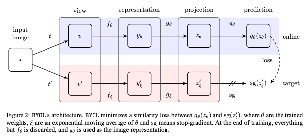

Siamese NN: 學習相似性，而不是學預測類別。  

# SimCLR
## Basic information
- Paper: [A Simple Framework for Contrastive Learning of Visual Representations](https://arxiv.org/abs/2002.05709)
- Conference: ICML'20
- author: Google Brain

## Key takeaway
* 在 self-supervised learning 中，需要更大的 batch size 跟 training step

* 從 representation 到算 loss，加上 non-linear transformation 會好很多。
* 可以和 supervised learning 差不多了。  

# MoCo
## Basic information
- Paper: [Momentum Contrast for Unsupervised Visual Representation Learning](https://arxiv.org/abs/1911.05722)
- Conference: CVPR'20
- author: Kaiming He (Facebook AI)

## Key takeaway
* Inspired by NLP pre-training. 
* 把 Constractive Learning 當成查字典的過程。把 CV feature 變成 discret feature。 一張圖片變成一個 token。 如果圖片夠像，應該要能對應到同一個 token。
* Benefit from Negative sample
* 會一直更新 MEM bank  

# BYOL
## Basic information
- Paper: [Bootstrap your own latent: A new approach to self-supervised Learning](https://arxiv.org/abs/2006.07733)
- Conference: CVPR'20
- author: DeepMind

## Key takeaway
* 真的需要 Negative example 嗎？能不能不要用 Negative example 來訓練？
* 設計**不對稱的 teacher-student 模型**，讓 student 學得比 teacher 更好，並且 fix teacher model 避免 collapse。

## Method & Model

* 同一張 input, 不同 augmentation method 分別當作 teacher / student model 的 input，目標使 output cosine simularity 小。  

# SimSiam
## Basic information
- Paper: [Exploring Simple Siamese Representation Learning](https://arxiv.org/abs/2011.10566)
- Conference: CVPR'20
- author: Facebook AI

## Key takeaway
* 目前最精簡的 self-supervising learning model.
* 真的需要兩個 encoder 嗎？可以只要一個就好嗎？
* Stop gradient + predictor 是最重要的因素。
* 對 batch normalization 很 sensitive，有加 batch normalization 會壞掉。

# Discussion notes
* 很常看到有人用 predictor (MLP)
* Q: Difference between semi-supervised learning and self-supervised learning?  
    - A: semi-supervised: 像 teacher-student model, 以少量的 groundtruth 訓練 teacher model, 再產生大量的 data 訓練 student model。 self-supervised 則是沒有 groundtruth, 以 augmentation 的方式生成 sample, 讓 model 自己學習區辨。  
    

# Reference
[1] [小全读论文《Momentum Contrast for Unsupervised Visual Representation Learning》(MoCo)](https://blog.csdn.net/FatMigo/article/details/103211622?fbclid=IwAR3IW5svlkpdY5Rc5UmoOCT11CQ63JJv93zWozwrK-vnB7s69Pwwwf60KKI)